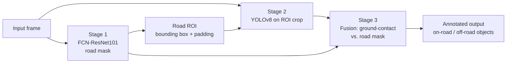

# Drivable Road Segmentation and Object Detection for Semi-Urban Roads

A deep learning perception system for autonomous vehicles operating on semi-urban and unstructured roads. The system combines **FCN-ResNet101** for drivable-road semantic segmentation with **YOLOv8** for object detection, and links the two in a **cascade pipeline** in which the segmentation output guides and contextualises the detector.

<p align="center">
  
  <br>
  <em>Figure 1. End-to-end semantic-segmentation-based drivable road detection on unstructured roads.</em>
</p>

---

## Table of Contents

1. [Abstract](#abstract)
2. [System Architecture](#system-architecture)
3. [Cascade Pipeline](#cascade-pipeline)
4. [Dataset](#dataset)
5. [Repository Structure](#repository-structure)
6. [Installation](#installation)
7. [Usage](#usage)
8. [Results](#results)
9. [Acknowledgements](#acknowledgements)

---

## Abstract

Autonomous vehicles require a precise perception of their surroundings to navigate safely. Lane and road-region detection is a critical component of this perception, as it allows the vehicle to determine its position and trajectory on the road. The task is particularly challenging in semi-urban environments, which contain a mixture of residential and commercial areas and a wide variety of road types, surface textures, and conditions, frequently without lane markings.

This project presents a deep learning-based approach to drivable-road detection on semi-urban roads. The proposed system consists of two components:

- **Semantic segmentation (FCN-ResNet101).** A fully convolutional network with a ResNet101 backbone classifies each pixel as *road* or *background*, providing a dense representation of the drivable surface across different road types and conditions.
- **Object detection (YOLOv8).** A real-time single-stage detector localises and classifies objects in the scene, such as vehicles, pedestrians, and obstacles.

The two models are integrated in a cascade: the road mask restricts where the detector searches and determines which detected objects lie on the drivable surface. Together they give the vehicle an accurate, context-aware perception of its environment, supporting safe navigation in semi-urban conditions.

---

## System Architecture

| Component | Model | Role |
|---|---|---|
| Road segmentation | FCN-ResNet101 (torchvision), 2-class head | Pixel-wise drivable-road mask |
| Object detection | YOLOv8 (Ultralytics), detection or `-seg` variant | Bounding boxes and, optionally, instance masks |
| Fusion | `cascade_pipeline.py` | ROI gating and road-aware filtering of detections |

---

## Cascade Pipeline

`cascade_pipeline.py` integrates the segmentation network and any Ultralytics YOLO model into a single three-stage pipeline.



| Stage | Description |
|---|---|
| **1. Road segmentation** | FCN-ResNet101 produces a binary drivable-road mask for the full frame. |
| **2. ROI-gated detection** | The bounding box of the road mask, expanded upward and sideways (objects stand *above* the road pixels they touch), is cropped and passed to YOLO. This discards irrelevant regions such as the sky and buildings, and gives small, distant objects more pixels at the detector input. If too little road is visible, the full frame is used instead. |
| **3. Road-aware fusion** | For each detection, the ground-contact region (the bottom strip of the bounding box, or of the instance mask when a `-seg` model is used) is intersected with the road mask. Objects whose overlap exceeds a threshold are labelled **on road**; the remaining detections can be kept or discarded. |

The pipeline accepts both YOLO detection weights (e.g. `yolov8n.pt`) and instance-segmentation weights (e.g. `yolov8n-seg.pt`). Segmentation weights produce more precise fusion, because the overlap is computed on the object's actual outline rather than on its bounding box.

In the output, the road is shaded green, on-road objects are drawn in red, off-road objects in grey, and the detector ROI in light blue.

---

## Dataset

### CARL-Dataset

The segmentation model is trained on the [CARL-Dataset](https://carl-dataset.github.io/index/), a benchmark for drivable-road region detection on unstructured roads, where lane markings are often absent.

| Property | Details |
|---|---|
| Size | 15,000 finely annotated images |
| Road types | Diverse unstructured and semi-urban road types |
| Classes | 2 — Road, Background |
| Annotation format | COCO, polygonal annotations |

### Additional Data

- **Object detection dataset.** A custom dataset was integrated to increase the diversity and complexity of object detection scenarios.
- **Pothole dataset.** A pothole dataset was incorporated so that the system can identify potential road hazards.

---

## Repository Structure

```
.
├── CARL-DATASET/              # Dataset root (download separately)
│   ├── train/   train_labels/
│   ├── val/     val_labels/
│   └── test/    test_labels/
├── runs/                      # TensorBoard logs of training and validation
├── train_seg_maps/            # Validation predictions saved during training
├── utils/
│   ├── helpers.py             # Colour maps, overlays, TensorBoard writer, checkpointing
│   └── metrics.py             # mIoU and pixel-accuracy metrics
├── config.py                  # Dataset path, classes, and training hyper-parameters
├── dataset.py                 # Dataset class, augmentation, and data loaders
├── model.py                   # FCN-ResNet101 segmentation model definition
├── engine.py                  # Training and validation loops
├── train.py                   # Training entry point; saves model.pth
├── eval.py                    # Evaluation script (placeholder)
├── road_detection_test.py     # Segmentation inference on a single image
├── test_vid.py                # Segmentation inference on a video
├── cascade_pipeline.py        # Cascade: segmentation → YOLO detection → fusion
└── requirements.txt
```

---

## Installation

### Prerequisites

| Requirement | Version |
|---|---|
| Python | 3.8 or later |
| PyTorch | 2.0.1 or later (CUDA 11.8 recommended) |
| torchvision | 0.15.2 or later |
| Ultralytics | 8.0 or later |
| Albumentations | 1.0.3 |
| TensorboardX | 2.2 |

The project was developed on Windows with Anaconda (Spyder), and runs on Linux and macOS as well.

### Setup

```bash
git clone https://github.com/ImaadHasan2002/Road-Segmentation-Object-Detection-using-Deep-Learning.git
cd Road-Segmentation-Object-Detection-using-Deep-Learning
pip install -r requirements.txt
```

For GPU support, install the PyTorch build that matches your CUDA version from [pytorch.org](https://pytorch.org/get-started/locally/).

---

## Usage

### 1. Training the Segmentation Model

1. Download the CARL-Dataset and place the `train`, `train_labels`, `val`, `val_labels`, `test`, and `test_labels` folders in `CARL-DATASET/`.
2. Set `ROOT_PATH` and the other parameters in `config.py`.
3. Start training:

   ```bash
   python train.py --resume-training no
   ```

   To resume from a checkpoint:

   ```bash
   python train.py --resume-training yes --model-path model.pth
   ```

### 2. Segmentation Inference

**Image**

```bash
python road_detection_test.py --model-path model.pth --input testimg.jpg
```

**Video**

```bash
python test_vid.py --model-path model.pth --input DSC_0006.mp4
```

Results are written to the `outputs/` directory.

### 3. Cascade Pipeline (Segmentation + YOLO)

```bash
# Image, with a YOLOv8 detection model
python cascade_pipeline.py --input testimg.jpg --seg-weights model.pth --yolo-weights yolov8n.pt

# Video, with a YOLOv8 instance-segmentation model and live preview
python cascade_pipeline.py --input DSC_0006.mp4 --seg-weights model.pth --yolo-weights yolov8n-seg.pt --show

# Webcam, keeping only vehicles and pedestrians that are on the road
python cascade_pipeline.py --input 0 --seg-weights model.pth --classes 0 1 2 3 5 7 --on-road-only
```

Ultralytics downloads the official YOLO weights automatically. A custom-trained YOLO model (for example, one trained on the pothole dataset) can be used by passing its `.pt` file to `--yolo-weights`.

| Argument | Default | Description |
|---|---|---|
| `--input` | — | Image path, video path, or webcam index |
| `--seg-weights` | — | Segmentation checkpoint produced by `train.py` |
| `--yolo-weights` | `yolov8n.pt` | Any Ultralytics detection or `-seg` model |
| `--device` | auto | `cuda`, `cuda:0`, or `cpu` |
| `--conf` / `--iou` | `0.25` / `0.45` | YOLO confidence and NMS IoU thresholds |
| `--imgsz` | `640` | YOLO input size |
| `--classes` | all | Restrict YOLO to the given class IDs |
| `--seg-size` | native | Resize the shorter side before segmentation (faster) |
| `--no-roi` | off | Run YOLO on the full frame instead of the road ROI |
| `--roi-padding` | `0.15` | ROI expansion as a fraction of the frame size |
| `--on-road-threshold` | `0.3` | Minimum road overlap for an object to count as on road |
| `--on-road-only` | off | Discard detections that are not on the road |
| `--output-dir` | `outputs` | Directory for annotated images and videos |
| `--show` | off | Display results in a window |

The pipeline can also be used from Python:

```python
import cv2
from cascade_pipeline import CascadeConfig, CascadePipeline, draw_result

pipeline = CascadePipeline(CascadeConfig(seg_weights='model.pth', yolo_weights='yolov8n-seg.pt'))
frame = cv2.imread('testimg.jpg')
result = pipeline(frame)

for det in result.detections:
    print(det.class_name, det.confidence, det.on_road, det.road_overlap)

cv2.imwrite('result.jpg', draw_result(frame, result))
```

---

## Results

Sample drivable-road segmentation results on unstructured roads:

<p align="center">
  
  &nbsp;
  
</p>
<p align="center"><em>Figure 2. Predicted drivable-road regions overlaid on test images.</em></p>

Training and validation curves (loss, mIoU, and pixel accuracy) can be viewed with TensorBoard:

```bash
tensorboard --logdir runs
```

---

## Acknowledgements

- [CARL-Dataset](https://carl-dataset.github.io/index/) for drivable-road annotations on unstructured roads.
- [torchvision](https://pytorch.org/vision/stable/models.html#semantic-segmentation) for the FCN-ResNet101 implementation.
- [Ultralytics YOLOv8](https://github.com/ultralytics/ultralytics) for real-time object detection.

Contributions that advance drivable-road detection for autonomous driving are welcome.
